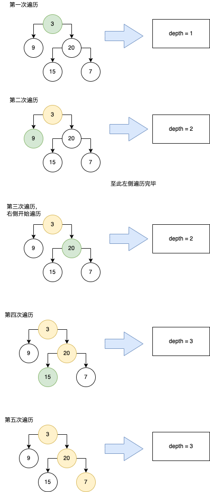

# 104. 二叉树的最大深度
[力扣原题传送们](https://leetcode-cn.com/problems/maximum-depth-of-binary-tree/)

### 解题思路
* 因为求的是最大深度，因此此处最简单的做法就是前序遍历，并设置一个变量depth,用来记录深度。

### 代码
```
class Solution {
    public int maxDepth(TreeNode root) {
        // 记录当前的深度
        int depth = 0;
        // 细腻的判断
        if(root == null ){
            return depth;
        }

        return trace(root,depth);
    }

    public int trace(TreeNode root,int depth){
        // 跳出循环条件，即已到达树的最深处
        if(root == null){
            return depth;
        }
        // 遍历一次则+1
        depth++;
        int left = trace(root.left,depth);
        int right = trace(root.right,depth);

        return Math.max(left,right);
    }
}
```

### 代码运行图
> 因此题过于简单只附一张流程图，其实少画了一个回溯的过程


