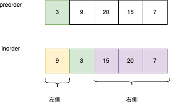
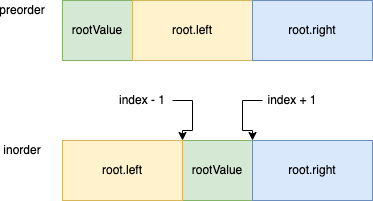

# 105. 从前序与中序遍历序列构造二叉树

[力扣原题传送门](https://leetcode-cn.com/problems/construct-binary-tree-from-preorder-and-inorder-traversal/)


### 解题思路
> 首先定位根节点，很明显前序遍历的第一个值，便是我们想要的


> 不难发现通过根结点的值，在中序排序中，这个值成了一个分界线，在分界线左侧的是左树的内容，右侧的是右树的内容<p>
  
##### 伪代码
```
         // 根结点的值
        int rootValue = preorder[pStart];
        int index = -1;
        for(int i=pStart;i<=pEnd;i++){
            if(inorder[i] == rootValue){
                index = i;
            }
        }

        TreeNode node = new TreeNode(rootValue);

        node.left = build(preorder, ?, ?, inorder, ?,?);
        node.right = build(preorder, ?, ?, inorder, ?,?);
```
> 现在问题无非就是确定4个参数如何填写
  
##### 理想的代码执行执行图


> 


### 代码

```
```


