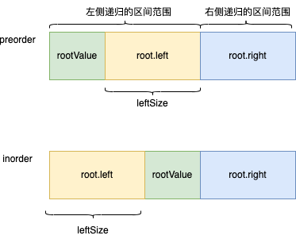

# 105. 从前序与中序遍历序列构造二叉树

[力扣原题传送门](https://leetcode-cn.com/problems/construct-binary-tree-from-preorder-and-inorder-traversal/)


### 解题思路
> 首先定位根节点，很明显前序遍历的第一个值，便是我们想要的


> 不难发现通过根结点的值，在中序排序中，这个值成了一个分界线，在分界线左侧的是左树的内容，右侧的是右树的内容<p>
  
##### 伪代码
```
         // 根结点的值
        int rootValue = preorder[pStart];
        int index = -1;
        for(int i=pStart;i<=pEnd;i++){
            if(inorder[i] == rootValue){
                index = i;
            }
        }

        TreeNode node = new TreeNode(rootValue);

        node.left = build(preorder, ?, ?, inorder, ?,?);
        node.right = build(preorder, ?, ?, inorder, ?,?);
```
> 现在问题无非就是确定8个参数如何填写
</br>
  
逻辑图</p>


> 看图的话，可以很容易的定位中序排序的索引开始位置和结束位置
  
```
        node.left = build(preorder, ?, ?, inorder, iStart,index -1);
        node.right = build(preorder, ?, ? , inorder,index + 1,iEnd);
```
 
继续分析</p>


> 看图的话，我们现在还缺少一个左子树节点数量的变量,有了左子树节点数量那就能把前序排序的数组范围定下来了
```
        int leftLength = index - iStart;

        node.left = build(preorder, pStart + 1, leftLength + pStart, inorder, iStart,index -1);
        node.right = build(preorder, leftLength + pStart + 1, pEnd , inorder,index + 1,iEnd);
```


### 代码
```
      public TreeNode buildTree(int[] preorder, int[] inorder) {
        return build(preorder,0,preorder.length - 1,inorder,0,inorder.length - 1);
    }

    /**
     * 构建二叉树
     *
     * @param preorder 前序遍历数组
     * @param pStart 前序遍历开始索引
     * @param pEnd 前序遍历结束索引
     * @param inorder 中序遍历数组
     * @param iStart 中序遍历开始
     * @param iEnd 中序遍历结束
     * @return
     */
    private TreeNode build(int[] preorder, int pStart, int pEnd, int[] inorder, int iStart, int iEnd) {
        if (pEnd < pStart) {
            return null;
        }

        // 根结点的值
        int rootValue = preorder[pStart];
        int index = -1;
                          
        // 找到中序节点中的分水岭
        for(int i=iStart;i<=iEnd;i++){
            if(inorder[i] == rootValue){
                index = i;
            }
        }

        TreeNode node = new TreeNode(rootValue);
        // 左树节点数
        int leftLength = index - iStart;

        node.left = build(preorder, pStart + 1, leftLength + pStart, inorder, iStart,index -1);
        node.right = build(preorder, leftLength + pStart + 1, pEnd , inorder,index + 1,iEnd);
        return node;
    }
  
```


