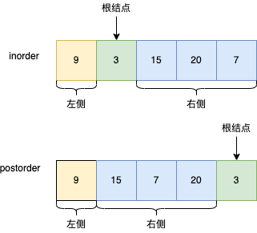
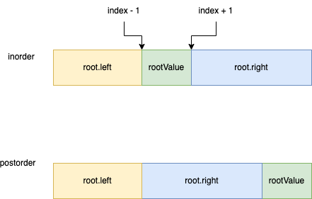
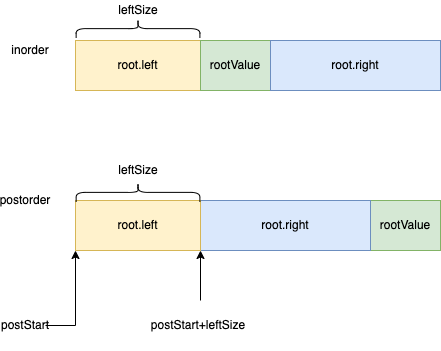

# 106. 从中序与后序遍历序列构造二叉树

[力扣原题传送门](https://leetcode-cn.com/problems/construct-binary-tree-from-inorder-and-postorder-traversal/)


### 解题思路

> 与[第105题](./Q_105.md)差不多，先通过后序遍历的数组获取根结点。



> 显然，后序遍历的尾节点就是我们要的根节点。

##### 伪代码
还是一样的套路
```
        // 数组越界判断
        if(inEnd > inStart || postEnd > postStart){
            return null;
        }

        // 获取根结点
        int rootVal = postorder[postEnd];
        // 定义根节点
        TreeNode treeNode = new TreeNode(rootVal);

        // 找到分割点
        int index = -1;
        for(int i=0; i<= inEnd; i++ ){
            if(inorder[i] == rootVal){
                index = i;
                break;
            }
        }
        

        treeNode.left = build(inorder,?,?,postorder,?,?);
        treeNode.right = build(inorder,?,?,postorder,?,?);
```

逻辑图</p>



先确定中序遍历的

```
        treeNode.left = build(inorder,inStart,index - 1,postorder,?, ?);
        treeNode.right = build(inorder,index + 1, inEnd,postorder,?,?);
```
</br>
继续分析



根据图上分析的结果填充数据

```
        int leftLength = index - inStart;
        treeNode.left = build(inorder,inStart,index - 1,postorder,postStart, postStart + leftLength - 1);
        treeNode.right = build(inorder,index + 1, inEnd,postorder,postStart + leftLength,postEnd - 1);
```


### 代码

```
    public TreeNode buildTree(int[] inorder, int[] postorder) {
        return build(inorder,0,inorder.length - 1,postorder,0,postorder.length - 1);
    }

    private TreeNode build(int[] inorder, int inStart, int inEnd, int[] postorder, int postStart, int postEnd) {
        // 数组越界判断
        if(inEnd < inStart){
            return null;
        }

        // 获取根结点
        int rootVal = postorder[postEnd];
        // 定义根节点
        TreeNode treeNode = new TreeNode(rootVal);

        // 找到分割点
        int index = -1;
        for(int i=0; i<= inEnd; i++ ){
            if(inorder[i] == rootVal){
                index = i;
                break;
            }
        }

        // 左节点数量
        int leftLength = index - inStart;

        treeNode.left = build(inorder,inStart,index - 1,postorder,postStart, postStart + leftLength - 1);

        treeNode.right = build(inorder,index + 1, inEnd,postorder,postStart + leftLength,postEnd - 1);

        return treeNode;
    } 
```
