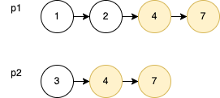
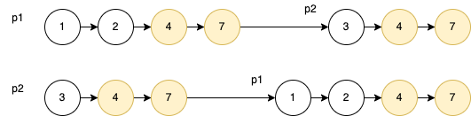

# 160. 相交链表
[力扣原题传送门](https://leetcode-cn.com/problems/intersection-of-two-linked-lists/)

### 解题思路
这道题最简单的做法是用一个set集合去记录下重复的节点
```
        Set<ListNode> set = new HashSet<ListNode>();

        ListNode p1 = headA;
        while(p1 != null){
            set.add(p1);
            p1 = p1.next;
        }

        ListNode p2 = headB;
        while(p2 != null){
            if(set.contains(p2)){
                return p2;
            }
            p2 = p2.next;

        }

        return null;
```

这种解法会用到额外的空间去保存各个节点的值，那有没有办法在不使用额外空间的情况下得出答案呢？</p>
难点在于，由于两条链表的长度可能不同，两条链表之间的节点无法对应。</p>


如果用两个指针 p1 和 p2 分别在两条链表上前进，并不能同时走到公共节点，也就无法得到相交节点 4。</p>

<strong>解决这个问题的关键是，通过某些方式，让 p1 和 p2 能够同时到达相交节点 4。</strong>

所以，我们可以让 p1 遍历完链表之后开始遍历链表 p2，让 p2 遍历完链表之后开始遍历链表p1，这样相当于「逻辑上」两条链表接在了一起。</p>

如果这样进行拼接，就可以让 p1 和 p2 同时进入公共部分，也就是同时到达相交节点 4：</p>



### 代码

```
    public ListNode getIntersectionNode(ListNode headA, ListNode headB) {

        ListNode p1 = headA;
        ListNode p2 = headB;

        while(p1 != p2){
            // 如果p1走一步是nul，就遍历headB
            if(p1 == null){
                p1 = headB;
            }else{
                p1 = p1.next;
            }
            // 如果p2走一步是nul，就遍历headA
            if(p2 == null){
                p2 = headA;
            }else{
                p2 = p2.next;
            }
        }

        return p1;
    }
}
```
