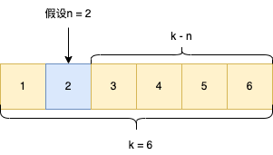
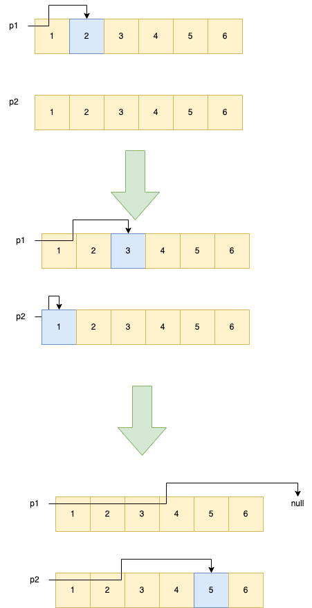

# 19. 删除链表的倒数第 N 个结点
[力扣原题传送门](https://leetcode-cn.com/problems/remove-nth-node-from-end-of-list/)

### 解题思路
这道题如果直接暴力破解的话，就是先从头到尾的遍历一遍，拿到链表的长度后在，计算倒数第n个节点的下标位置
然后删除该节点，这样做的话可能会超时，所以换个思路。</p>
1.首先开启一个指针p1找到第n个节点所在的位置，这个应该不难。

<br/>

找到n所在位置后，p1先停下。
<strong>如果假设数组的长度为k,那倒数第n个节点所在的位置就是k-n。</strong>
如上图第n个节点所在的位置到链表的结尾正好是k-n。</p>

那这个时候开启第二个指针p2，与此同时p1也重新继续遍历，直到p1.next =null,那这个时候p2
行走的距离正好是k - n。


### 代码

```
    public ListNode removeNthFromEnd(ListNode head, int n) {
        ListNode dummy = new ListNode(-1);
        dummy.next = head;
        // 删除倒数第 n 个，要先找倒数第 n + 1 个节点
        ListNode x = findFromEnd(dummy, n + 1);
        // 删掉倒数第 n 个节点
        x.next = x.next.next;
        return dummy.next;
    }


    ListNode findFromEnd(ListNode head, int k) {
        ListNode p1 = head;
        // p1 先走 k 步
        for (int i = 0; i < k; i++) {
            p1 = p1.next;
        }
        ListNode p2 = head;
        // p1 和 p2 同时走 n - k 步
        while (p1 != null) {
            p2 = p2.next;
            p1 = p1.next;
        }
        // p2 现在指向第 n - k 个节点
        return p2;
    }
```
