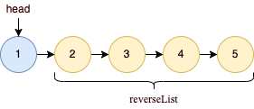
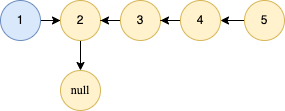
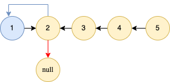
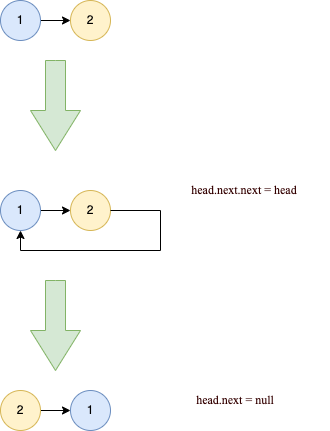

# 206. 反转链表
[力扣原题传送门](https://leetcode-cn.com/problems/reverse-linked-list/)

### 解题思路
> 这道题使用递归的方式来反转链表，直接上代码先。

### 代码
```
    public ListNode reverseList(ListNode head) {
        if (head == null || head.next == null) {
            return head;
        }

        ListNode node = reverseList(head.next);
        head.next.next = head;
        head.next = null;
        return node;
    }
```

### 代码解释
刚看到递归的解法却是有点晕头转向，不知道为什么这链表就奇迹般的反转了。

<strong>对于递归算法，最重要的就是明确递归函数的定义。</strong>具体来说，我们的 reverse 函数定义是这样的：

输入一个节点 head，将「以 head 为起点」的链表反转，并返回反转之后的头结点。

<strong>不要跳进递归（你的脑袋能压几个栈呀？），而是要根据刚才的函数定义，来弄清楚这段代码会产生什么结果：</strong>



这个 reverseList(head.next) 执行完成后，整个链表就成了这样



这个时候执行完
```
        head.next.next = head;
        head.next = null;
```

就变成了这样




图解具体发生了什么事，以最后一步为例



这里代码主要是如下几个步骤
* 将当前节点与他下级节点相连接，形成一个环
* 将当前节点指向下一节点的指针置为null，这样就不再是环了，顺理成章的转成了链表

