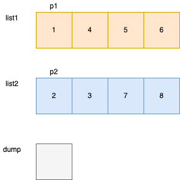

# 21. 合并两个有序链表
[力扣原题传送门](https://leetcode-cn.com/problems/merge-two-sorted-lists/)

### 解题思路
1.其实最简单的就是暴力破解,直接2个for循环完事。</p>
2.采用双指针，使用while循环左，比较优雅。</p>

### 代码

```
    public ListNode mergeTwoLists(ListNode list1, ListNode list2) {
        // 记录结果
        ListNode dummy = new ListNode(),result = dummy;
        ListNode p = list1,p2 = list2;

        while(p != null && p2 != null){

            if(p.val > p2.val){
                result.next = p2;
                p2 = p2.next;
            }else{
                result.next = p;
                p = p.next;
            }
            // 指针向后进一位
            result = result.next;
        }

        if(p != null){
            result.next = p;
        }

        if(p2 != null){
            result.next = p2;
        }

        return dummy.next;
    }
```

> 这里需要注意指针的变化

### 代码运行图


