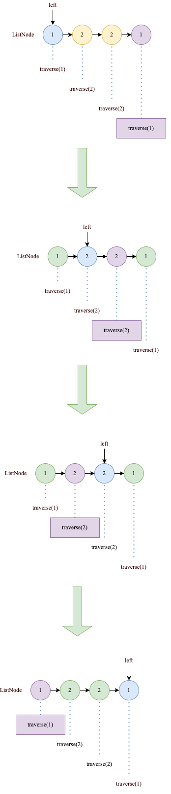

# 234. 回文链表
[力扣原题传送门](https://leetcode-cn.com/problems/palindrome-linked-list/)

### 解题思路

首先回顾什么是[回文字符串,力扣第5题](./Q_5.md)

这道题的关键在于，单链表无法倒着遍历，无法使用双指针技巧。

那么最简单的办法就是，把原始链表反转存入一条新的链表，然后比较这两条链表是否相同。

但是这么做应该是会超时的😂，那么换个思路。

<strong>借助二叉树后序遍历的思路，不需要显式反转原始链表也可以倒序遍历链表</strong>

链表兼具递归结构，树结构不过是链表的衍生。那么，<strong>链表其实也可以有前序遍历和后序遍历：</strong>

```
    public void traverse(ListNode head) {

        if(head == null){
            return;
        }
        
        // 前序遍历
        traverse(head.next);
        // 后序遍历
    }
```


### 代码
```
    ListNode left;

    public boolean isPalindrome(ListNode head) {
        left = head;
        boolean flag = traverse(head);
        return flag;
    }


    public boolean traverse(ListNode right){
        if(right == null){
             return true;
        }

        boolean res = traverse(right.next);

        res = res && left.val == right.val;
        left = left.next;
        return res;
    }
```

### 代码执行图



### 优化空间复杂度

1.先通过快慢指针找到中点

```
ListNode slow, fast;
slow = fast = head;
while (fast != null && fast.next != null) {
    slow = slow.next;
    fast = fast.next.next;
}
```


          
如图，如果fast没有指向null,即基数的情况下,slow指针还要向前走一步
          


递归的话从slow开始反转，现在改造下代码

```
    public boolean isPalindrome(ListNode head) {
        ListNode left = head;
        ListNode fast,slow,p;

        p = head;
        fast = head;
        slow = head;
        while(fast != null && fast.next != null){
            fast = fast.next.next;
            slow = slow.next;
        }

        // 基数情况slow在往后移动一不
        if(fast != null){
            slow = slow.next;
        }
        // 如果slow是null那有2种情况
        // 要么listNode是null或者listNode的size = 1
        if(slow == null){
            return true;
        }

        ListNode reverseRight =  reverse(slow);

        while(reverseRight != null){
            if(reverseRight.val != left.val){
                return false;
            }
            reverseRight = reverseRight.next;
            left = left.next;
        }
        return true;
    }


    public ListNode reverse(ListNode right){
        if(right.next == null){
            return right;
        }

        ListNode node = reverse(right.next);

        right.next.next = right;
        right.next = null;

        return node;
    }
```
