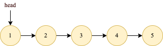
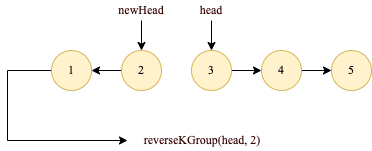
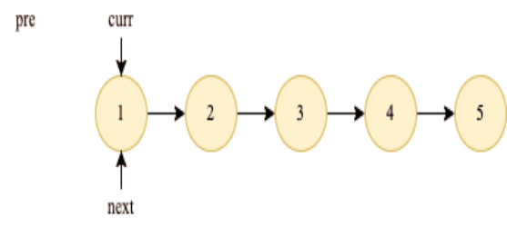

# 25. K 个一组翻转链表
[力扣原题传送门](https://leetcode-cn.com/problems/reverse-nodes-in-k-group/)

### 解题思路
链表是一种兼具递归和迭代性质的数据结构，<strong>认真思考一下可以发现这个问题具有递归性质。</strong>

什么叫递归性质？

比如说我们对链表调用 reverseKGroup(head, 2)，即以 2 个节点为一组反转链表


  
如果我设法把前 2 个节点反转，那么后面的那些节点怎么处理？
  
后面的这些节点也是一条链表，而且规模（长度）比原来这条链表小，这就叫<strong>子问题。</strong>



我们可以把原先的 head 指针移动到后面这一段链表的开头，然后继续递归调用 reverseKGroup(head, 2)，因为子问题（后面这部分链表）和原问题（整条链表）的结构完全相同，这就是所谓的递归性质。

发现了递归性质，就可以得到大致的算法流程：

1、先反转以 head 开头的 k 个元素。

2、将第 k + 1 个元素作为 head 递归调用 reverseKGroup 函数。

3、将上述两个过程的结果连接起来。

首先，我们要实现一个 reverse 函数反转一个区间之内的元素。在此之前我们再简化一下，给定链表头结点，如何反转整个链表？

```
    public ListNode reverse(ListNode head){
        ListNode pre = null;
        ListNode curr = head;
        ListNode next = head;

        while(curr != null){
            next = curr.next;
            // 逐个结点反转
            curr.next = pre;
            // 更新指针位置
            pre = curr;
            curr = next;

        }
        // 返回反转后的头结点
        return pre;
    }
```

算法执行的过程如下 GIF 所示 : 



「反转以 a 为头结点的链表」其实就是「反转 a 到 null 之间的结点」

改造下，「反转 a 到 b 之间的结点」

```
    public ListNode reverse(ListNode a, ListNode b){
        ListNode pre = null;
        ListNode curr = a;
        ListNode next = a;

        while(curr != b){
            next = curr.next;
            // 逐个结点反转
            curr.next = pre;
            // 更新指针位置
            pre = curr;
            curr = next;

        }
        // 返回反转后的头结点
        return pre;
    }

```

现在我们迭代实现了反转部分链表的功能，接下来就按照之前的逻辑编写 reverseKGroup 函数即可


### 代码
```
    public ListNode reverseKGroup(ListNode head, int k) {
        if (head == null){
            return null;
        }

        ListNode a = head;
        ListNode b = head;

        for(int i = 0; i< k; i++){
            if(b == null) {
                return head;
            }
            b = b.next;
        }
        // 反转前 k 个元素
        ListNode newHead = reverse(a, b);
        a.next = reverseKGroup(b, k);
        return newHead;
    }


    ListNode reverse(ListNode a, ListNode b) {
        ListNode pre, cur, nxt;
        pre = null; cur = a; nxt = a;
        // while 终止的条件改一下就行了
        while (cur != b) {
            nxt = cur.next;
            cur.next = pre;
            pre = cur;
            cur = nxt;
        }
        // 返回反转后的头结点
        return pre;
    }
```
