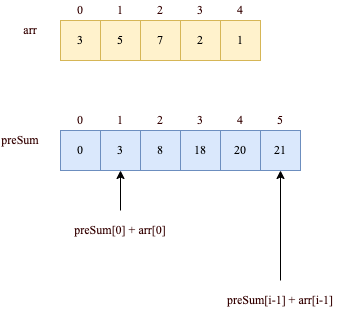

# 303. 区域和检索 - 数组不可变
[力扣原题传送门](https://leetcode-cn.com/problems/range-sum-query-immutable/)

### 解题思路

sumRange 函数需要计算并返回一个索引区间之内的元素和

我们可以先简单的写下代码

```
    private int[] nums;

    public NumArray(int[] nums) {
        this.nums = nums;
    }
    
    public int sumRange(int left, int right) {
        int res = 0;
        for (int i = left; i <= right; i++) {
            res += nums[i];
        }
        return res;
    }
```

怎么样，很简单吧？计算数组中left和right之间的元素数，以达到效果，但是效率很差，因为 sumRange 方法会被频繁调用

这道题的最优解法是使用前缀和技巧，将 sumRange 函数的时间复杂度降为 O(1)，说白了就是不要在 sumRange 里面用 for 循环

1.我们需要修改下构造函数：

```
        // 初始化preSum数组
        preSum = new int[nums.length + 1];
        // 计算 nums 的累加和
        for (int i = 1; i < preSum.length; i++) {
            preSum[i] = preSum[i - 1] + nums[i - 1];
        }
```

preSum[i] 记录 nums[0..i-1] 的累加和



### 代码

```
    // 前缀和数组
    private int[] preSum;

    /* 输入一个数组，构造前缀和 */
    public NumArray(int[] nums) {
        // preSum[0] = 0，便于计算累加和
        preSum = new int[nums.length + 1];
        // 计算 nums 的累加和
        for (int i = 1; i < preSum.length; i++) {
            preSum[i] = preSum[i - 1] + nums[i - 1];
        }
    }
    
    /* 查询闭区间 [left, right] 的累加和 */
    public int sumRange(int left, int right) {
        return preSum[right + 1] - preSum[left];
    }
```
