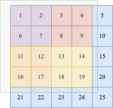

# 304. 二维区域和检索 - 矩阵不可变
[力扣原题传送门](https://leetcode-cn.com/problems/range-sum-query-2d-immutable/)

### 解题思路

其实这道题与[力扣303题](./Q_303.md)差不多。

先用最简单的方式解下这题

```
        int[][]matrix;
        public NumMatrix(int[][] matrix) {
            this.matrix = matrix;
        }

        public int sumRegion(int row1, int col1, int row2, int col2) {
            
            int sum = 0;
            for(int i=row1;i<=row2;i++){
                for(int j=col1;j <= col2;j++){
                    sum += matrix[i][j];
                }
            }
            
            return sum;
        }
```

同样可以优化。先看图:



如图，如果计算黄色部分的总和，可以这么计算

黄色总和 = 灰色部分总和 - （紫色+红色） - （紫色+橙色） + 紫色

而灰色部分，紫色+红色，紫色+橙色，紫色这四个矩阵有一个共同的特点，就是左上角就是 (0, 0) 原点。

那么我们可以维护一个二维 preSum 数组，专门记录以原点为顶点的矩阵的元素之和，就可以用几次加减运算算出任何一个子矩阵的元素和

### 代码

```
        int[][]preSum;

        public NumMatrix(int[][] matrix) {
            int m = matrix.length, n = matrix[0].length;
            if (m == 0 || n == 0) return;
            // 初始化数组,这里创建的二维数组第一行与第一列都是0
            preSum = new int[m + 1][n +1];

            for (int i = 1; i <= m; i++) {
                for (int j = 1; j <= n; j++) {
                    // 计算每个矩阵 [0, 0, i, j] 的元素和
                    preSum[i][j] = preSum[i-1][j] + preSum[i][j-1] + matrix[i - 1][j - 1] - preSum[i-1][j-1];
                }
            }
        }


        public int sumRegion(int row1, int col1, int row2, int col2) {
            return preSum[row2+1][col2+1] - preSum[row1][col2+1] - preSum[row2+1][col1] + preSum[row1][col1];
        }
```
