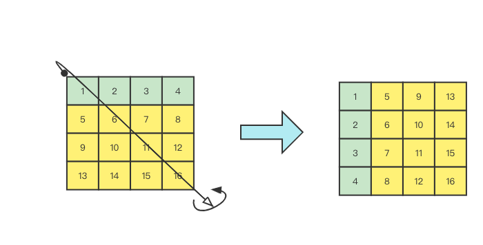
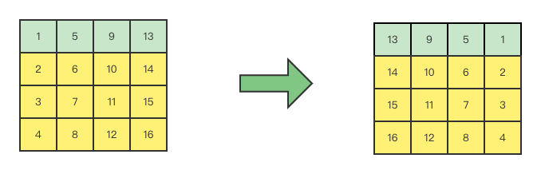

# 48. 旋转图像

[力扣原题传送门](https://leetcode-cn.com/problems/rotate-image/)

### 解题思路

这道题不能走寻常路，在讲巧妙解法之前，我们先看另一道谷歌曾经考过的算法题热热身：

给你一个包含若干单词和空格的字符串 s，请你写一个算法，原地反转所有单词的顺序。

比如说，给你输入这样一个字符串：<strong>hello world</strong>

你的算法需要<strong>原地</strong>反转这个字符串中的单词顺序：<strong>world hello</strong>

常规的方式是把 s 按空格 split 成若干单词，然后 reverse 这些单词的顺序，最后把这些单词 join 成句子。

但这种方式使用了额外的空间，并不是「原地反转」单词。

正确的做法是，先将整个字符串 s 反转：<strong>dlrow olleh</strong>

然后将每个单词分别反转：<strong>world hello</strong>

有了这个思路回到题目

<strong>1.首先我们将矩阵按照左上到右下的对角线进行镜像对称</strong>



<strong>2.对矩阵的每一行进行反转</strong>



我们可以发现得到的结果解释旋转90度的结果。

### 代码

```
    public void rotate(int[][] matrix) {
        int n = matrix.length;

        int[][] arr = new int[matrix.length][matrix.length];

        for(int i=0; i< n; i++){
            for(int j=i; j < n;j++){
                // 沿对角线互换
                int temp = matrix[i][j];
                matrix[i][j] = matrix[j][i];
                matrix[j][i] = temp;
            }
        }


        for (int[] row : matrix) {
            reverse(row);
        }
    }

    private void reverse(int[] arr) {
        int i = 0, j = arr.length - 1;
        while (j > i) {
            // swap(arr[i], arr[j]);
            int temp = arr[i];
            arr[i] = arr[j];
            arr[j] = temp;
            i++;
            j--;
        }
    }
```
