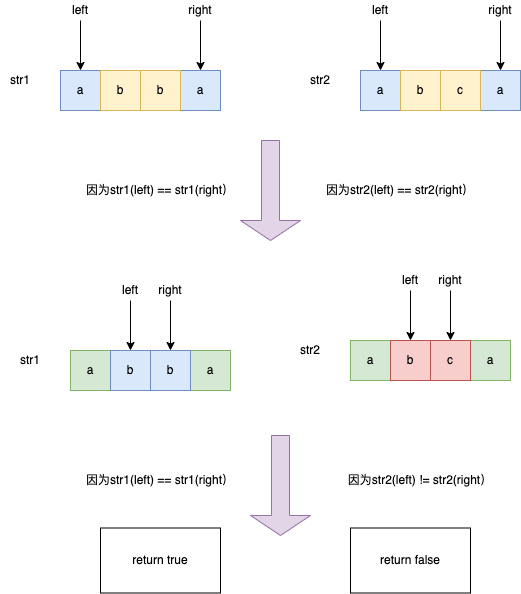
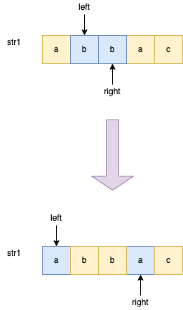

# 5. 最长回文子串
[力扣原题传送门](https://leetcode-cn.com/problems/longest-palindromic-substring/)

### 解题思路

首先明确一下，回文串就是正着读和反着读都一样的字符串。

比如说字符串 aba 和 abba 都是回文串，因为它们对称，反过来还是和本身一样；反之，字符串 abac 就不是回文串。

先简单点，判断一个字符串是否是回文串

```
boolean isPalindrome(String s) {
    // 一左一右两个指针相向而行
    int left = 0, right = s.length() - 1;
    while (left < right) {
        if (s.charAt(left) != s.charAt(right)) {
            return false;
        }
        left++;
        right--;
    }
    return true;
}
```



回道题目，找回文串的难点在于，回文串的的长度可能是奇数也可能是偶数，解决该问题的核心是<strong>从中心向两端扩散的双指针技巧。</strong>

如果回文串的长度为奇数，则它有一个中心字符；如果回文串的长度为偶数，则可以认为它有两个中心字符。

所以我们可以先实现这样一个函数：

```
    // 在 s 中寻找以 s[l] 和 s[r] 为中心的最长回文串
    public static String palindore(String s,int left,int right){
        while(left >= 0 && right < s.length()
                && s.charAt(left) == s.charAt(right)){
            left--;
            right++;
        }

        return s.substring(left+1,right);
    }
```



如图给定字符串"abbac",这时候我们只要能确定left,right指针的位置就能返回一个回文字符串

这样，如果输入相同的 left 和 right，就相当于寻找长度为奇数的回文串，如果输入相邻的 left 和 right，则相当于寻找长度为偶数的回文串。

那么回到最长回文串的问题，解法的大致思路就是：

```
for 0 <= i < len(s):
    找到以 s[i] 为中心的回文串
    找到以 s[i] 和 s[i+1] 为中心的回文串
    更新答案
```

### 代码

```
    public String longestPalindrome(String s) {
        String res = "";

        if(s == null){
            return s;
        }

        for(int i=0; i < s.length(); i++){

            String str1 = palindore(s,i,i);
            String str2 = palindore(s,i,i+1);

            res = str1.length() > res.length() ? str1 : res;
            res = str2.length() > res.length() ? str2 : res;
        }

        return res;
    }


    public String palindore(String s,int left,int right){
        while(left >= 0 && right < s.length()
                && s.charAt(left) == s.charAt(right)){
            left--;
            right++;
        }

        return s.substring(left+1,right);
    }
```
