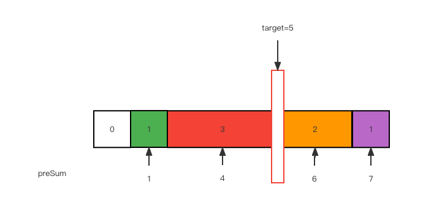

# 528. 按权重随机选择

[力扣原题传送门](https://leetcode-cn.com/problems/random-pick-with-weight/)

### 解题思路

先理解下题意，这道题其实是让你写一个算法

假设每个元素都有不同的权重，权重地大小代表随机选到这个元素的概率大小，如何写算法去随机获取元素。

假设给你输入的权重数组是 w = [1,3,2,1]，我们想让概率符合权重，那么可以抽象一下，根据权重画出这么一条彩色的线段：


如果我在线段上面随机丢一个石子，石子落在哪个颜色上，我就选择该颜色对应的权重索引，那么每个索引被选中的概率是不是就是和权重相关联了？

所以，你再仔细看看这条彩色的线段像什么？这不就是<strong>前缀和数组</strong>嘛：


那么接下来，如何模拟在线段上扔石子？

当然是随机数，比如上述前缀和数组 preSum，取值范围是 [1, 7]，那么我生成一个在这个区间的随机数 target = 5，就好像在这条线段中随机扔了一颗石子：



preSum 中并没有 5 这个元素，我们应该选择比 5 大的最小元素，也就是 6

<strong>如何快速寻找数组中大于等于目标值的最小元素？ 二分搜索算法 就是我们想要的。</strong>

到这里，这道题的核心思路就说完了，主要分几步：

1、根据权重数组 w 生成前缀和数组 preSum。

2、生成一个取值在 preSum 之内的随机数，用二分搜索算法寻找大于等于这个随机数的最小元素索引。

3、最后对这个索引减一（因为前缀和数组有一位索引偏移），就可以作为权重数组的索引，即最终答案

### 代码

```
        // 前缀和数组
        private int[] preSum;
        private Random rand = new Random();

        public Solution(int[] w) {
            int n = w.length;
            // 构建前缀和数组，偏移一位留给 preSum[0]
            preSum = new int[n + 1];
            for (int i = 1; i <= n; i++) {
                preSum[i] = preSum[i - 1] + w[i - 1];
            }
        }

        public int pickIndex() {
            int n = preSum.length;
            // 在闭区间 [1, preSum[n - 1]] 中随机选择一个数字
            int target = rand.nextInt(preSum[n - 1]) + 1;
            // 获取 target 在前缀和数组 preSum 中的索引
            // 别忘了前缀和数组 preSum 和原始数组 w 有一位索引偏移
            return left_bound(preSum, target) - 1;
        }

        int left_bound(int[] nums, int target) {
            if(nums.length == 0){
                return -1;
            }
            int left = 0, right = nums.length;
            while(left < right){
                int mid = left + (right - left)/2;
                if(nums[mid] == target){
                    // 直接找到了
                    right = mid;
                }else if(nums[mid] < target){
                    left = mid + 1;
                }else{
                    right = mid;
                }
            }
            return left;
        }
```
