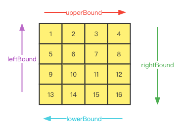

# 54. 螺旋矩阵

[力扣原题传送门](https://leetcode-cn.com/problems/spiral-matrix/)

### 解题思路

解题的核心思路是按照右、下、左、上的顺序遍历数组，并使用四个变量圈定未遍历元素的边界：



随着螺旋遍历，相应的边界会收缩，直到螺旋遍历完整个数组：


### 代码

```
    public List<Integer> spiralOrder(int[][] matrix) {
        List<Integer> res = new LinkedList<>();

        // 矩阵行
        int row = matrix.length;
        // 矩阵列
        int col = matrix[0].length;
        // 链表长度
        int size = row * col;
        // 上边界索引位置
        int upperBound = 0;
        // 右边界索引位置
        int rightBound = col - 1;
        // 下边界索引位置
        int lowerBound = row - 1;
        //  左边界索引位置
        int leftBound = 0;

        while(res.size() < size){
            // 向右移动
            if (upperBound <= lowerBound) {
                // 在顶部从左向右遍历
                for (int i = leftBound; i <= rightBound; i++) {
                    res.add(matrix[upperBound][i]);
                }
                // 上边界下移
                upperBound++;
            }

            // 向下移动
            if (leftBound <= rightBound) {
                // 在右侧从上向下遍历
                for (int i = upperBound; i <= lowerBound; i++) {
                    res.add(matrix[i][rightBound]);
                }
                // 右边界左移
                rightBound--;
            }


            // 向左移动
            if (upperBound <= lowerBound) {
                // 在底部从右向左遍历
                for (int j = rightBound; j >= leftBound; j--) {
                    res.add(matrix[lowerBound][j]);
                }
                // 下边界上移
                lowerBound--;
            }

            // 向上移动
            if (leftBound <= rightBound) {
                // 在左侧从下向上遍历
                for (int i = lowerBound; i >= upperBound; i--) {
                    res.add(matrix[i][leftBound]);
                }
                // 左边界右移
                leftBound++;
            }
        }


        return res;
    }
```
