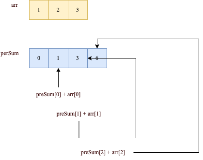
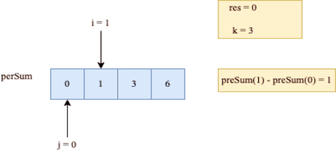
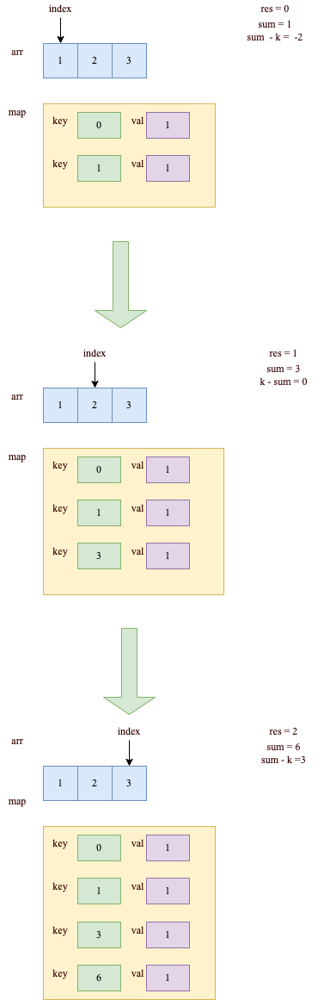

# 560. 和为 K 的子数组

[力扣原题传送门](https://leetcode-cn.com/problems/subarray-sum-equals-k/)

### 解题思路

先利用前缀和的套路,前缀和参考[力扣303题](./Q_303.md)和[力扣304题](./Q_304.md),可以写出如下代码

```
    int res = 0;
    int[]preSum = new int[nums.length + 1];

    for(int i=0; i< nums.length; i++){
        preSum[i + 1] = nums[i] + preSum[i];
    }
    
    // 穷举所有子数组
    for(int i=1; i <= nums.length; i++){
        for(int j= 0; j < i; j++){
            // 子数组 nums[j..i-1] 的元素和
            if(preSum[i] - preSum[j] == k){
                res++;
            }
        }
    }

    return res;
```

先画图说明下代码做了些什么事吧。



如图preSum数组记录了，到每个阶段为止的和

现在来看看for循环主要做了些什么



这里主要是先穷举所有子数组，下标从1开始，即nums[0]...nums[i]每个阶段的和

第二层 for 循环在干嘛呢？翻译一下就是，在计算，有几个 j 能够使得 preSum[i] 和 preSum[j] 的差为 k。毎找到一个这样的 j，就把结果加一。

我们也可以把 if 语句里的条件判断移项，这样写：

```
if (preSum[j] == preSum[i] - k)
    res++;
```

这里有个优化的思路:

<strong>直接记录下有几个 preSum[j] 和 preSum[i] - k 相等，直接更新结果，就避免了内层的 for 循环。</strong>我们可以用哈希表，在记录前缀和的同时记录该前缀和出现的次数。

### 代码

```
    public int subarraySum(int[] nums, int k) {
        int n = nums.length;
        // map：前缀和 -> 该前缀和出现的次数
        HashMap<Integer, Integer>
                preSum = new HashMap<>();
        // base case
        preSum.put(0, 1);

        int res = 0, sum = 0;

        for(int i=0; i<n; i++){
            // 记录到当前阶段为止的和
            sum += nums[i];
            // 这是我们想找的前缀和 nums[0..j]
            int sum0_j = sum - k;
            // 如果前面有这个前缀和，则直接更新答案
            if (preSum.containsKey(sum0_j))
                res += preSum.get(sum0_j);
            // 把前缀和 nums[0..i] 加入并记录出现次数
            preSum.put(sum,
                    preSum.getOrDefault(sum, 0) + 1);
        }

        return res;

    }
```

### 代码运行图


