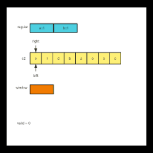

# 567. 字符串的排列

[力扣原题传送门](https://leetcode-cn.com/problems/permutation-in-string/)

### 解题思路

这道题还是参考[力扣76题](./Q_76.md),还是一样使用到了滑动窗口。

> 注意哦，输入的 s1 是可以包含重复字符的，所以这个题难度不小。

先把模版复制过来：

```
        public void Sliding(String str, String regular){
        HashMap<Character,Integer> need = new HashMap<>();
        HashMap<Character,Integer> window = new HashMap<>();

        for (int i=0; i < str.length() - 1; i++){
            need.put(str.charAt(i),1);
        }

        int left = 0, right  = 0, valid = 0;

        while(right < str.length()){
            // c 是将移入窗口的字符
            char c = str.charAt(right);
            // 右移（增大）窗口
            right++;
            // 进行窗口内数据的一系列更新
            // TODO


            // 判断左侧窗口是否要收缩
            while (true) {
                // d 是将移出窗口的字符
                char d = str.charAt(left);
                // 左移（缩小）窗口
                left++;
                // 进行窗口内数据的一系列更新
                // TODO
            }
        }
```

然后思考四个问题:

* 当移动 right 扩大窗口，即加入字符时，应该更新哪些数据？

> 这里应当将满足条件的字符串放入窗口，如果与需求一致，则记录下满足的数量

* 什么条件下，窗口应该暂停扩大，开始移动 left 缩小窗口？

> 当窗口的大小大于规则的长度时，移动left，使得窗口内的字符串长度与规则一样长为止

* 当移动 left 缩小窗口，即移出字符时，应该更新哪些数据？

> 1.将字符串移出窗口
> 2.将记录满足熟练的valid--

* 我们要的结果应该在扩大窗口时还是缩小窗口时进行更新？

> 满足条件直接返回

图解:



### 代码

```
    public boolean checkInclusion(String s1, String s2) {
        HashMap<Character,Integer> window = new HashMap<>();
        HashMap<Character,Integer> need = new HashMap<>();

        // 保存规则
        for (char c : s1.toCharArray()) {
            need.put(c,need.getOrDefault(c,0) + 1);
        }

        // 左右指针
        int left = 0,right = 0;
        // 记录符合要求的数量
        int valid = 0;


        while(right < s2.length()){
            char c = s2.charAt(right);

            // 右侧窗口开始滑动
            right++;

            // 将满足要求的字符串放入窗口
            if(need.containsKey(c)){
                window.put(c,window.getOrDefault(c,0) + 1);
                // 满足条
                if(need.get(c).equals(window.get(c))){
                    valid++;
                }
            }

            // 左侧窗口滑动需要满足整个窗口的size大于规则的size
            while(right - left >= s1.length()){
                // 如果满足要求则不再需要滑动窗口直接返回即可
               if(valid == need.size()){
                    return true;
               }

               char d = s2.charAt(left);

               left++;
               // 左侧窗口滑动时需把窗口中的值移除
               if(window.containsKey(d)){

                   if(window.get(d).equals(need.get(d))){
                       valid --;
                   }

                   window.put(d,window.getOrDefault(d,0) - 1);
               }
            }

        }
        return false;
    }
```
