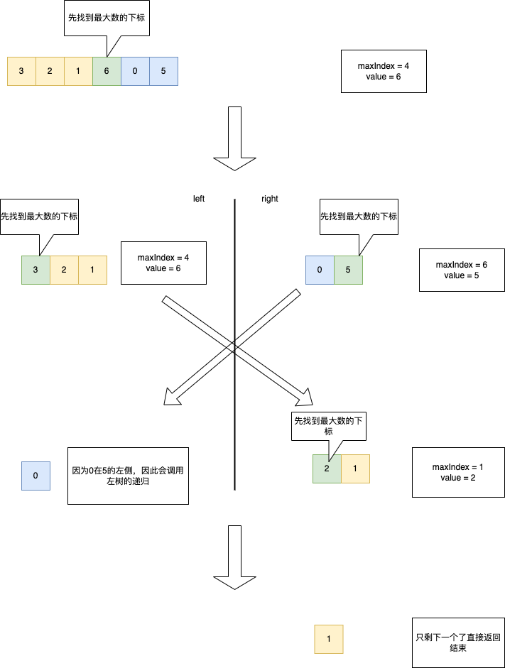

# 654. 最大二叉树

[力扣原题传送门](https://leetcode-cn.com/problems/maximum-binary-tree/)


### 解题思路

> 虽然是标注的是中等难度的题，但我感觉应该算是简单的，解发很简单</p>
> 1.首先根据给定的数组找到最大值的下标
> 2.递归调用左右数组构造左右子树即可


### 代码

```
    public TreeNode constructMaximumBinaryTree(int[] nums) {
        return build(nums,0,nums.length - 1);
    }

    public TreeNode build(int[]nums,int start,int end){
        if(end < start){
            return null;
        }
        int maxIndex = -1;
        int maxValue = Integer.MIN_VALUE;

        // 先找到最大值的下标
        for(int i=start; i<= end; i++){
            if(nums[i] > maxValue){
                maxValue = nums[i];
                maxIndex = i;
            }
        }

        TreeNode node = new TreeNode(nums[maxIndex]);
        node.left = build(nums,start,maxIndex - 1);
        node.right = build(nums,maxIndex + 1,end);
        return node;
    }
```


### 代码运行图

