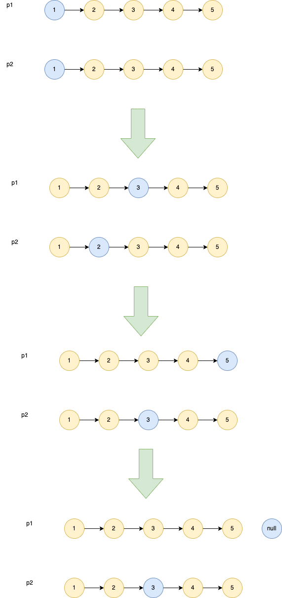

# 876. 链表的中间结点
[力扣原题传送门](https://leetcode-cn.com/problems/middle-of-the-linked-list/)

### 解题思路
这道题的思路和[力扣19题](./Q_16.md)类似,也是采用2个指针的做法。这里需要采用快慢两种指针，1个指针
每次走2步做为快指针，另一个指针每次走一步做为慢指针，当快指针的下个节点是null的时候，慢指针所在的位置
就是中间节点的位置</p>



### 代码

```
    public ListNode middleNode(ListNode head) {
        // 创建2个指针p1为快指针，p2慢指针
        ListNode p1 = head;
        ListNode p2 = head;

        while (p1.next != null){
            p1 = p1.next;
            // 这里需要判断下空指针
            if(p1.next == null){
                return p2.next;
            }
            p1 = p1.next;

            p2 = p2.next;
        }

        return p2;
    }
```
