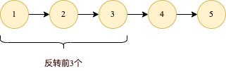
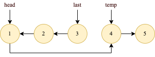

# 92. 反转链表 II
[力扣原题传送门](https://leetcode-cn.com/problems/reverse-linked-list-ii/)

### 解题思路
在解这道题前先思考下:

如果给个链表，要求将链表的前 n 个节点反转（n <= 链表长度）

其实与[206题](./Q_206.md)差不多，只不过需要改变下思路。



如图要求将链表的前3个反转,代码如下:

```
    // 后驱节点
    ListNode temp = null;


    public ListNode reverseN(ListNode head, int n){
        if(n == 1){
            // 保存下第 n + 1 个节点
            temp = head.next;
            return head;
        }

        ListNode last = reverseN(head.next,n - 1);
        head.next.next = head;
        // 让反转之后的 head 节点和后面的节点连起来
        head.next = temp;
        return last;
    }
```



OK，如果这个函数你也能看懂，就离实现「反转一部分链表」不远了。

回到92题，给一个索引区间 [m,n]（索引从 1 开始），仅仅反转区间中的链表元素。

首先，如果 m == 1，就相当于反转链表开头的 n 个元素嘛，也就是我们刚才实现的功能。


如果 m != 1 怎么办？如果我们把 head 的索引视为 1，那么我们是想从第 m 个元素开始反转对吧；如果把 head.next 的索引视为 1 呢？

那么相对于 head.next，反转的区间应该是从第 m - 1 个元素开始的；那么对于 head.next.next 呢……


### 代码
```
    public ListNode reverseBetween(ListNode head, int left, int right) {
        if (left == 1) {
            return reverseN(head, right);
        }
        // 前进到反转的起点触发 base case
        head.next = reverseBetween(head.next, left - 1, right - 1);
        return head;
    }
    
    // 后驱节点
    ListNode temp = null; 

    ListNode reverseN(ListNode head, int n) {
        if (n == 1) {
            temp = head.next;
            return head;
        }

        ListNode node = reverseN(head.next, n - 1);
        head.next.next = head;
        head.next = temp;

        return node;

    }
```
